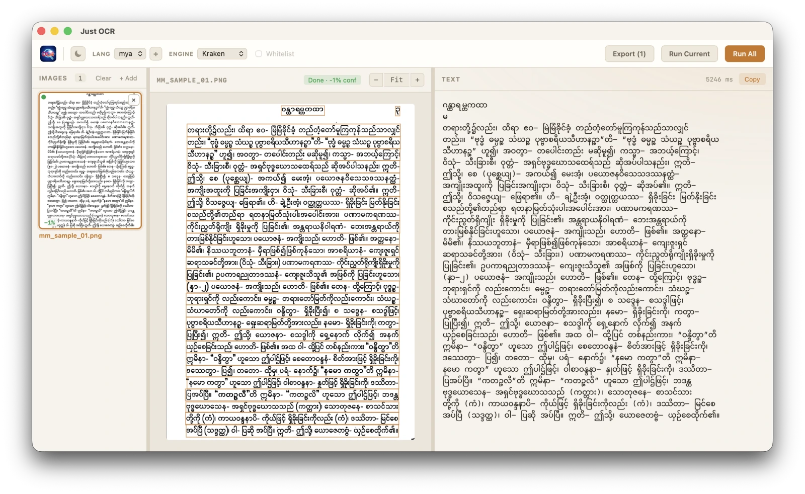

# just-ocr

Offline OCR GUI built with Tauri 2 + Svelte. Recognizes Latin scripts via
[Tesseract](https://github.com/tesseract-ocr/tesseract) (5.5.2, statically
linked via the [`tesseract-rs`](https://github.com/cafercangundogdu/tesseract-rs)
binding) and complex scripts — currently Burmese — via a vendored
[candle](https://github.com/huggingface/candle) port of [Kraken](https://kraken.re).

Both engines' models are embedded in the binary, so the resulting app is fully
standalone — no system installs required.



*Three-panel layout: image list, preview with per-line bounding-box overlay,
and recognized text + timing. Shown here on a Burmese scan with Kraken
segmentation + recognition.*

## OCR pipeline

The pipeline is **language-driven**:

- **Myanmar (`mya`)** → Kraken does layout segmentation (hidden — Tesseract's
  layout is poor for Myanmar script), then a recognizer of your choice
  (**Kraken** by default, or **Tesseract**) recognizes each line. Kraken
  recognition runs in parallel across the rayon pool.
- **Any other language** → full-page Tesseract with the user-selected page
  segmentation mode (PSM). Tesseract handles both layout and recognition.

Pick the language first in the toolbar; the relevant controls appear.

## Requirements

- Rust 1.88+, Node 18+
- C++17 compiler (clang/gcc/MSVC) and **CMake** — needed for the one-time
  Tesseract + Leptonica build (cached under `~/Library/Application Support/tesseract-rs` on macOS)
- Internet access on first build (the crate downloads tesseract/leptonica sources)

## Develop

```sh
npm install
cargo tauri dev
```

The first build takes several minutes because it compiles Tesseract + the
candle neural-network crates. Subsequent builds reuse the cache.

The Kraken models live in `kraken-models/` (`bur_segment.safetensors`,
`bur_recog.safetensors`) and are embedded via `include_bytes!`. They're tracked
via Git LFS — see [Releasing](#releasing) below.

## Build a distributable app

```sh
cargo tauri build
```

Produces a `.app` + `.dmg` on macOS, `.deb`/`.AppImage` on Linux, `.msi`/`.exe`
on Windows. The ~21 MB of Kraken model weights are baked into the binary.

Power users can override the bundled models by placing
`bur_segment.safetensors` + `bur_recog.safetensors` in the platform's app data
dir (macOS: `~/Library/Application Support/com.justocr.app/kraken-models/`).
If both files exist there, they take precedence over the bundled bytes.

## Usage

1. Drag an image (PNG/JPG/BMP/WebP) or a PDF onto the dropzone, or click to
   browse. PDFs become one job per page. When you add a PDF, a dialog asks how
   to process it: **Extract** pulls the embedded scan at its native resolution
   (fast, best for scanned PDFs); **Render** rasterizes each page at 1500 px
   height (for vector or mixed-content PDFs).
2. Pick a language.
   - **Myanmar** → an Engine selector appears (Kraken default, Tesseract option).
   - **Other languages** → a PSM selector appears (Auto / Single block / etc.).
3. Optionally enable a char whitelist (Tesseract only).
4. Click **Run Current** (single image) or **Run All** (batch). Recognized text,
   per-line bounding boxes (overlaid on the preview), confidence, and elapsed
   time appear in the result panel. Use **Copy** to copy the text, **Export**
   to save all results as CSV/TXT.

## Adding more languages

The `embed-tessdata` feature bundles `eng` and `tur` by default; `mya` is
bundled via `include_bytes!`. To embed other Tesseract languages at build time:

```sh
TESSERACT_EMBED_LANGUAGES=eng,fra,deu cargo tauri build
```

Kraken recognition currently supports only the bundled Burmese model — the
recognition network's architecture is parsed dynamically from the safetensors
header (VGSL spec + class count), but a different script would need a different
recog model placed in `kraken-models/`.

## Releasing

Releases are built by `.github/workflows/release.yml` using
[`tauri-action`](https://github.com/tauri-apps/tauri-action). It builds for
macOS (Apple Silicon + Intel), Linux, and Windows, and attaches the bundles to
a draft GitHub Release.

**Trigger:** push a tag matching `v*` (e.g. `v0.1.0`):

```sh
git tag v0.1.0
git push origin v0.1.0
```

The release is created as a **draft** — review the bundles on the GitHub
Releases page and publish manually when ready.

### One-time setup: Git LFS for the Kraken models

The model weights (`kraken-models/*.safetensors`, ~21 MB total) are tracked
via Git LFS so the git history stays small while still being available to CI.
`.gitattributes` records the tracking rule. To set up LFS locally (once per
machine):

```sh
brew install git-lfs          # or: apt install git-lfs / choco install git-lfs
git lfs install               # enables LFS for your user account
# Clone or pull — LFS fetches the real file contents automatically.
```

If you're adding the models for the first time (already done in this repo —
this is for reference), the sequence is:

```sh
git lfs track "kraken-models/*.safetensors"
git add .gitattributes
git add kraken-models/bur_segment.safetensors kraken-models/bur_recog.safetensors
git commit -m "Track kraken models via Git LFS"
```

The workflow pulls LFS files in CI before the Rust build so `include_bytes!`
resolves correctly.
